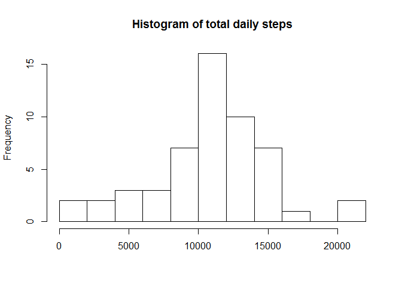
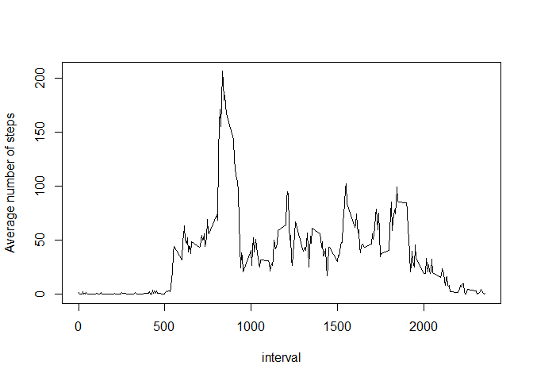
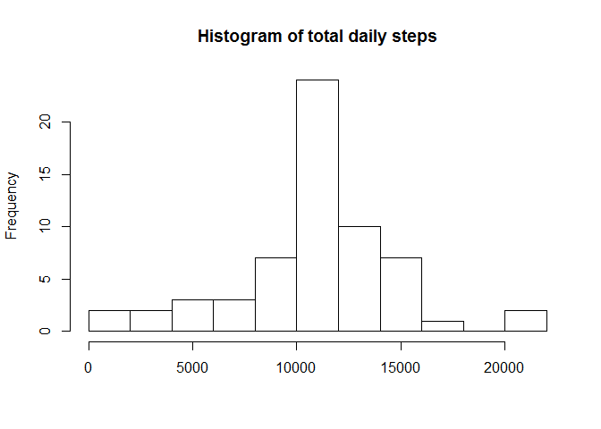

# Reproducible Research: Peer Assessment 1
First, I load necessary libraries with messages supressed.  Doing this once so future messages aren't silently supressed

```r
library(dplyr)
```

## Loading and preprocessing the data

First I load the data and transform the date column into a more usable format


```r
activity <- read.csv("activity.csv", header=TRUE)
#Convert the dates
Date <- strptime(activity$date, "%Y-%m-%d")

#Create a logical vectors of everything other than the original date
#then bind those columns with the new Date back to our data frame
lv <- names(activity) != "date"
activity <- cbind(activity[,lv], Date)

#Does everything look ok?
summary(activity)
```

```
##      steps          interval         Date                    
##  Min.   :  0.0   Min.   :   0   Min.   :2012-10-01 00:00:00  
##  1st Qu.:  0.0   1st Qu.: 589   1st Qu.:2012-10-16 00:00:00  
##  Median :  0.0   Median :1178   Median :2012-10-31 00:00:00  
##  Mean   : 37.4   Mean   :1178   Mean   :2012-10-31 00:25:34  
##  3rd Qu.: 12.0   3rd Qu.:1766   3rd Qu.:2012-11-15 00:00:00  
##  Max.   :806.0   Max.   :2355   Max.   :2012-11-30 00:00:00  
##  NA's   :2304
```

## What is mean total number of steps taken per day?

```r
totalByDay = activity %>%
              group_by(Date) %>%
              summarise(sum=sum(steps))

hist(totalByDay$sum, breaks=10, main = "Histogram of total daily steps",
     xlab = NULL)
```

 

Calculate mean and median of the daily totals, ignoring days that totalled to NA values. Based on the histogram I am expecting values between 10,000 and 11,000


```r
mean(totalByDay$sum, na.rm=TRUE)
```

```
## [1] 10766
```

```r
median(totalByDay$sum, na.rm=TRUE)
```

```
## [1] 10765
```

## What is the average daily activity pattern?


```r
averageByInterval <- activity %>%
                      group_by(interval) %>%
                      summarise(avg=mean(steps, na.rm = TRUE))
plot(averageByInterval, type="l", ylab ="Average number of steps")
```

 

Which interval has the maximum average number of steps?

```r
averageByInterval <- activity %>%
                      group_by(interval) %>%
                      summarise(avg=mean(steps, na.rm = TRUE))

averageByInterval[averageByInterval$avg==max(averageByInterval$avg),]
```

```
## Source: local data frame [1 x 2]
## 
##     interval   avg
## 104      835 206.2
```

## Imputing missing values
How many missing values are we dealing with?  Is it a large proportion?

```r
sum(is.na(activity$steps))
```

```
## [1] 2304
```

```r
sum(is.na(activity$steps)) / nrow(activity)
```

```
## [1] 0.1311
```
I will replace the missing values with the average number of steps taken during that interval for which we have values


```r
# Get just the rows with missing steps
missing <- activity[is.na(activity$steps),]

# Add a column for imputed values. This combination of mutate()
# and sapply() is a little messy -- there is probably a nicer way
missing <- mutate(missing, 
                  steps=sapply(interval, 
                               function(y) averageByInterval[averageByInterval$interval == y,]$avg))

# Create a new data frame with 1) original rows with non-null steps 2) newly created data points

newActivity = rbind(activity[!is.na(activity$steps),],
                    missing)
```
Lets check that we have the same number of rows we started with and that there are no null values in steps any more

```r
nrow(activity) == nrow(newActivity)
```

```
## [1] TRUE
```

```r
sum(is.na(newActivity$steps))
```

```
## [1] 0
```

Now I recreate our original histogram and recacluate the mean and median with our new data set.

```r
newTotalByDay = newActivity %>%
                group_by(Date) %>%
                summarise(sum=sum(steps))

hist(newTotalByDay$sum, breaks=10, 
     main = "Histogram of total daily steps",
     xlab = NULL)
```

 

```r
mean(newTotalByDay$sum)
```

```
## [1] 10766
```

```r
median(newTotalByDay$sum)
```

```
## [1] 10766
```
Imputing missing values does not seem to have changed my estimate of the mean or median much at all.

```r
format(mean(newTotalByDay$sum) / mean(totalByDay$sum, na.rm = TRUE), nsmall=5)
```

```
## [1] "1.00000"
```

```r
format(median(newTotalByDay$sum) / median(totalByDay$sum, na.rm = TRUE),nsmall=5)
```

```
## [1] "1.00011"
```
## Are there differences in activity patterns between weekdays and weekends?
