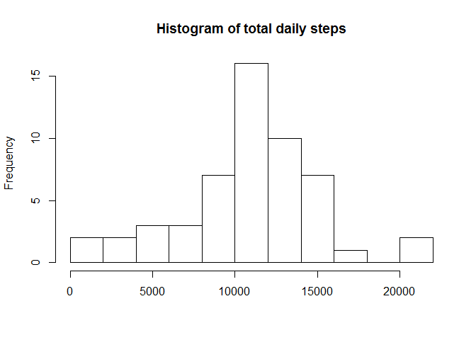

# Reproducible Research: Peer Assessment 1

## Loading and preprocessing the data

First I load the data and transform the date column into a more usable format


```r
activity <- read.csv("activity.csv", header=TRUE)
#Convert the dates
Date <- strptime(activity$date, "%Y-%m-%d")

#Create a logical vectors of everything other than the original date
#then bind those columns with the new Date back to our data frame
lv <- names(activity) != "date"
activity <- cbind(activity[,lv], Date)

#Does everything look ok?
summary(activity)
```

```
##      steps          interval         Date                    
##  Min.   :  0.0   Min.   :   0   Min.   :2012-10-01 00:00:00  
##  1st Qu.:  0.0   1st Qu.: 589   1st Qu.:2012-10-16 00:00:00  
##  Median :  0.0   Median :1178   Median :2012-10-31 00:00:00  
##  Mean   : 37.4   Mean   :1178   Mean   :2012-10-31 00:25:34  
##  3rd Qu.: 12.0   3rd Qu.:1766   3rd Qu.:2012-11-15 00:00:00  
##  Max.   :806.0   Max.   :2355   Max.   :2012-11-30 00:00:00  
##  NA's   :2304
```

## What is mean total number of steps taken per day?

```r
library(dplyr)
totalByDay = activity %>%
              group_by(Date) %>%
              summarise(sum=sum(steps))

hist(totalByDay$sum, breaks=10, main = "Histogram of total daily steps",
     xlab = NULL)
```

 

## What is the average daily activity pattern?


## Imputing missing values


## Are there differences in activity patterns between weekdays and weekends?
